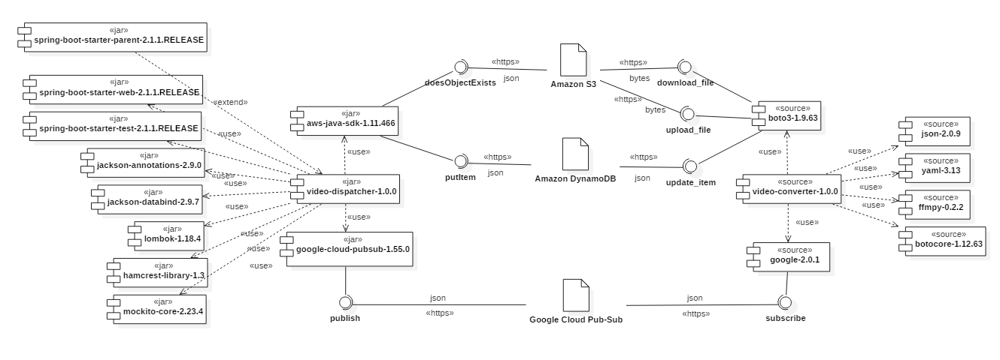

# Video Dispatcher

This REST API publishes messages to Google Cloud Pub/Sub, requiring the conversion of files stored in an Amazon S3 
bucket. It eventually puts objects in a DynamoDB table.

## Requirements

### Credentials

Make sure you have credentials for both AWS and Google Cloud :

**AWS**

The credentials for Amazon Web Services are stored in the file `~/.aws/credentials`.

**Google Cloud**

The credentials are stored in a `.json` file. The environment variable `GOOGLE_APPLICATION_CREDENTIALS` defines the 
location of this file on your computer. You can set it as follows:
```bash
export GOOGLE_APPLICATION_CREDENTIALS=<path_to_service_account_file>
```

### Build tool

We use Maven as the build tool for the project. Please [download it](https://maven.apache.org/download.cgi) and add 
the executable to your `PATH` variable.  

## Compilation

If every requirement is completed, you can compile the project as shown below:
```bash
mvn install
```

## Execution

After building the project, you can run the `.jar` by executing the following command:
```bash
java -jar target/video-dispatcher-<version>.jar
```

## UML component diagram



## Why Amazon DynamoDB

**Reliability:**
 * Hosted on Amazon cloud
 * Fully managed service
 * \#2 rank in [DB-engines ranking](https://db-engines.com/en/ranking/document+store) of document stores
 
**Functionality:**
 * NoSQL (schema-free)
 * Supports Java and Python
 * Continuous backup over the last 35 days

**Performance:**
 * Single-digit millisecond responsiveness at any scale
 * In memory cache reducing response time